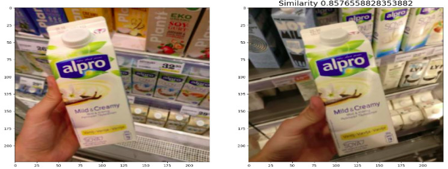

# One shot learning for product classfication

## Overview
This project implements a product classifier using a Siamese Neural Network with pre-trained base models. The classifier is designed to identify different product categories based on images provided in the training dataset. It utilizes transfer learning techniques to leverage the features learned from a pre-trained base model to achieve better classification accuracy.

The Siamese Neural Network architecture is employed for learning similarity between images rather than classifying individual images. The network takes two images as input and produces a similarity score, which indicates how similar the two images are in terms of their product categories.

## Requirements
Ensure you have Python and pip installed on your system. Use the following command to install the required Python libraries:

```bash
pip install -r requirements.txt
```
## How to Use
1. Data Preparation:

Place your training dataset in the appropriate directory. The project expects the dataset to be organized as follows:
```bash
data/
├── product/
│ ├── train/
│ │ ├── Category_1/
│ │ │ ├── image_1.jpg
│ │ │ ├── image_2.jpg
│ │ │ └── ...
│ │ ├── Category_2/
│ │ └── ...
│ ├── val/
│ │ ├── Category_1/
│ │ └── ...
│ └── test/
│ ├── Category_1/
│ └── ...
```
2. Model Configuration:

In cam_test.py and product_classifier.py, you can modify the parameters under the section Parameters to choose the base model (base_id) and the path to the saved training weights (weights_filename) that the Siamese model will use.

3. Training (Optional):

If you have not already trained the model, you can run product_classifier.py to train the Siamese model on your dataset. This step is optional if you already have pre-trained weights available.

4. Testing:

To test the product classifier, execute cam_test.py. This script will open a webcam window, allowing you to capture screenshots by pressing the spacebar. The captured screenshots will be compared to the product categories in the training dataset using the Siamese model, and the predicted label with the highest similarity score will be displayed.

## Credits
- This project utilizes the power of transfer learning and Siamese Neural Networks to achieve accurate product classification.
- The base models used for feature extraction are provided by the Keras library.
- The dataset used for training and testing is collected from [Freiburg Groceries dataset](http://aisdatasets.informatik.uni-freiburg.de/freiburg_groceries_dataset/)
- Thanks to [hNao17](https://github.com/hNao17) for inspiring me this project
